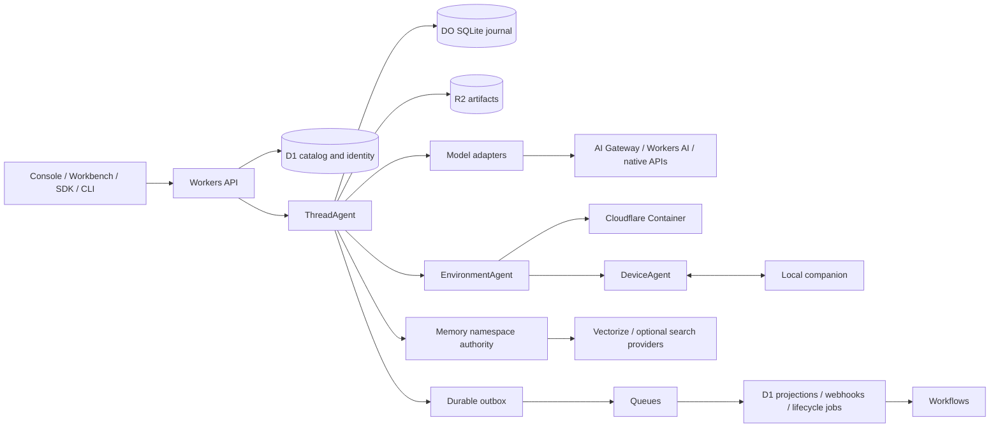

# Architecture proposal

Status: proposed on 2026-10-07. The owner has selected an independent full rewrite with Cloudflare cloud infrastructure and a local companion. The detailed design below still needs the feasibility and parity evidence in the [implementation plan](../plans/full-rewrite.md).

## System boundaries



Two execution hosts consume the independently defined Asterweft contracts:

- **Cloud host:** TypeScript runtime on Agents SDK and Durable Objects. Python extensions execute in a Cloudflare Sandbox process through a typed extension boundary.
- **Embedded host:** a separately implemented Python harness executing the caller's tools in the caller's Python process. It is not the remote Service SDK. Native Pydantic AI interoperability is a separate parity requirement.

The cloud host owns durable execution; the embedded host's application chooses persistence and scheduling. The local companion owns operating-system resources, not the cloud thread's conversation state.

## Proposed repository layout

These are intended packages, not files that already implement the product.

```text
apps/
  edge/                  Workers HTTP API, authentication and bindings
  console/               resource and team administration
  workbench/             collaborative project, conversation and desktop UI
packages/
  contracts/             independently authored schemas and event vocabulary
  runtime/               portable TypeScript transition and execution logic
  cloudflare-runtime/    Agent/Fiber, SQLite, R2 and Queue adapters
  providers/             models, web, memory, connectors, environments
  think-adapter/         optional Think engine and parity adapter
  memory/                file and record memory contracts and implementations
  sdk-typescript/        remote client and finite Interaction abstraction
python/
  harness/               true in-process runtime and native extension support
  sdk/                   remote Service client
  tui/                   interactive terminal host
crates/
  companion/             files, processes, sessions and device transport
  desktop-macos/         macOS capture and input integration
  desktop-windows/       Windows capture, input and process integration
  desktop-linux/         Linux desktop and process integration
  sdk/                   Rust remote Service client
  cli/                   remote command-line client
go/sdk/                  Go remote Service client
images/                  Cloudflare execution and Python extension images
conformance/             independently authored scenarios and sanitized evidence
infra/                   bindings, migrations, provisioning and release recipes
```

This separation preserves the distinction between a public service console and a personal/trusted-team workbench. They can share components and contracts without making host-desktop control an implicit capability of every console user.

## Data ownership

| Aggregate | Authority | Secondary representation |
|---|---|---|
| Accounts, organizations, workspaces, grants and API keys | D1 catalog | bounded caches keyed by authorization revision |
| Agent and skill revisions; provider definitions and resource metadata | D1 catalog | immutable content in R2; run stores selected revision identity |
| Thread input order, runs, attempts, answers, committed messages, call intents | one ThreadAgent SQLite database | D1 searchable projection; R2 large payloads |
| Parent/child linkage | parent records its request; child owns its own run | idempotent cross-object completion receipts |
| Environment desired lifecycle and allocation receipts | one EnvironmentAgent | D1 list projection; provider/container owns actual execution |
| Device pairing and command delivery | DeviceAgent plus device-local command journal | D1 device inventory; no duplicate process authority |
| File-memory paths, versions and conditional writes | one MemoryNamespaceAgent | content-addressed R2 blobs and revision manifests |
| Record-memory documents and tombstones | memory authority | Vectorize projection; optional provider-backed records keep that provider's contract |
| Collaborative drafts and presence | CollaborationAgent | drafts are never accepted run input until explicit submit |
| Artifacts and checkpoints | immutable R2 objects, referenced by authoritative journal | metadata queries in D1 |

A D1 run row is a projection, not an alternate owner of a running task. The distinction matters during replica lag, queue delay, and recovery. D1 identity reads use an explicitly selected consistency policy; a stale replica cannot silently authorize a revoked credential.

## Run admission and execution

1. The edge authenticates the caller, resolves workspace scope, validates the request, and obtains the selected immutable configuration revision. Client-supplied object names and tenant IDs are never trusted routing authority.
2. ThreadAgent accepts a submission with a scoped idempotency key and canonical payload digest. The transaction records a receipt, input, ordering version, and durable intent to wake execution. A duplicate key with a different payload is a conflict.
3. Success is returned only after durable wake registration is confirmed. Wake registration failure returns a retryable result; retry consults the same receipt. Reconciliation must cover a crash after input commit and before starting a Fiber.
4. The actor chooses the next eligible input and associates it with the consuming run. A new attempt obtains an epoch. Every transition after an `await` validates the expected epoch and state version.
5. A Fiber drives bounded model/tool work. The thread journal remains the authority; Fiber stash data is a recovery hint or a reference to a committed journal position. It must not become a second divergent checkpoint store.
6. Before an external effect, record its stable call identity, input digest, replay class and attempt. After the result, commit its outcome. Failure between the two is an explicit uncertain outcome unless the adapter can prove the result.
7. Produce immutable R2 payloads before committing pointers to them. Commit checkpoint references, resulting messages, usage facts, and outbox entries together in the thread's storage boundary.
8. Persist terminal or waiting state. Stream observations remain provisional; clients read the durable outcome and committed history for authoritative results.

DO requests can interleave around asynchronous work. Single-object ownership does not remove the need for transaction boundaries or fencing. Old attempts must fail to commit even if an external response arrives after cancellation or recovery.

## Failure cases that drive the design

| Cut point | Required recovery |
|---|---|
| Input persisted, caller loses response | same submission returns the original receipt |
| Input persisted, background wake not registered | retry or durable reconciliation starts work without duplicate input |
| Model request sent, connection lost | preserve attempt identity; query provider recovery where supported, otherwise record bounded reattempt |
| Tool side effect succeeds, receipt not stored | reconcile by provider key/receipt; otherwise expose uncertainty, not blind replay |
| R2 upload succeeds, SQLite commit fails | blob stays unreferenced and can be collected later |
| SQLite commits, Queue send fails | outbox remains pending and is retried |
| Queue duplicates or reorders messages | event IDs and per-aggregate sequence checks prevent duplicate projection effects |
| Child created, parent acknowledgement lost | deterministic child-request identity finds existing child |
| Cancel races with child completion | terminal state and completion handling are version-checked and idempotent |
| Deploy interrupts a stream | client resumes from its observation cursor or receives an explicit replay gap |
| Container survives a Worker deploy | reconnect to the existing instance; do not assume new image or environment applies |
| Container ends and restores files | process and terminal handles become stale; do not map them to reused OS PIDs |
| Device executes while cloud connection drops | query the device's command journal after reconnect; never resend as a new command |

Acceptance scenarios must actively cause these failures. Unit tests of a pure transition function alone cannot validate recovery across Cloudflare services.

## Queues, Fibers and Workflows

The **thread actor** owns run order and state. A **Fiber** hosts its recoverable execution. **Queues** transport outbox work and may deliver more than once. **Workflows** own separate operations such as environment provisioning, bulk import, cleanup, and search indexing.

Do not put the whole agent loop inside one retried Workflow step. Do not let a Workflow and a Fiber both decide whether the same model/tool action should be retried. The owner records the decision; transports only deliver requests or observations of it.

The current Agents SDK also offers co-located sub-agents through Facets. They have isolated SQLite but share the parent's physical alarm and support transitive deletion. Use independent ThreadAgent ownership for durable ChildRuns by default so retention and cancellation follow the baseline contract. A Facets adapter can serve tightly coupled helpers after explicit lifecycle tests; calling `subAgent()` alone does not establish ChildRun equivalence. See [official sub-agent documentation](https://developers.cloudflare.com/agents/runtime/execution/sub-agents/).

Long-lived data is retained in project-owned storage. Cloudflare workflow history, browser sessions, trace retention, and container snapshots each have their own retention boundaries. None is the sole durable store for user history.

## Execution environments

The Cloudflare adapter targets Sandbox SDK 1.0 and the native container interface. It must implement the environment contract explicitly: session mapping, argv versus shell, command lifecycle, stdout/stderr byte offsets, file writers and commit, capability negotiation, process cancellation, ports, readiness, timeout and cleanup.

Custom images supply their own required Python, shell, Git, and helper programs. Credential injection stays in the host request layer where possible. Preview URLs are authenticated and scoped to the environment and viewer. File persistence and process persistence are different features.

All eleven baseline environment integration types remain required. Default deployment uses Cloudflare execution. Optional external integrations preserve users' existing capabilities without becoming required cloud infrastructure.

Restricted Python CodeAct remains a separate contract from Cloudflare Code Mode. Evaluate Monty in a controlled Python or supported native process first. A WASM package that expects browser Web Workers or Node worker threads is not automatically workerd-compatible. Code Mode supplies an additional typed tool-orchestration path after its capability and recovery tests pass.

## Local companion

The companion establishes an outbound authenticated connection to DeviceAgent. Initial pairing binds device, owner and allowed workspace; the device keeps its private credential in the operating system's credential store. Reconnect rotates a connection generation without changing existing command identity.

Each command carries a stable ID, scope, target environment/session, payload digest, expiration, and expected device generation. The local SQLite journal records accepted, started and finished states. Cloud reconnection asks for existing command status; it does not assume no response means no execution.

Filesystem access uses explicit granted roots and platform path handling. Symlinks, Windows drive/UNC paths, case sensitivity, cancellation of process trees, output retention, PTY resize and desktop coordinate transforms need platform-specific tests. Desktop viewing and input control are explicit separate capabilities.

This is a development protocol proposal. Platform desktop APIs and signing/installer details must be verified from their official documentation during the early feasibility work. No macOS, Windows, or Linux desktop implementation has been verified yet.

## Models, tools, memory and credentials

Model adapters preserve native messages, tool identifiers, continuation fields, reasoning-related opaque state, media limits and usage. A common high-level interface must not erase provider-specific state. Gateway and direct routes undergo the same continuation tests. Model selection comes from a versioned configuration; catalog presence alone is not proof of live support.

Cloud MCP uses supported remote transports; local stdio servers execute through the local companion or a Cloudflare Sandbox extension process. OAuth token refresh and revocation belong to the connection authority. MCP Apps use isolated rendering and a bounded bridge to their own connection, not unrestricted host APIs.

File memory owns versioned filesystem-like state. Record memory owns records and retrieval. Knowledge search is a third resource type. The default record store can use Workers AI embeddings and Vectorize, but result visibility and deletion are governed by the record authority and index version, not by assuming index updates are immediate.

Deployment secrets can use Workers Secrets or Secrets Store. Tenant credentials use envelope encryption with versioned keys and tenant/resource identity in authenticated associated data. Execution snapshots carry credential references, never secret values. Refresh, rotation, deletion and redacted diagnostics require independent tests.

## Scale and observability

A hot thread is sequential by design; scale independent threads horizontally. Store bounded active state and segment long history into R2. D1 stores indexed metadata and query projections, with an explicit shard migration plan before reaching its per-database limit. A shard registry must route only to provisioned bindings; a proposed shard identifier alone is not a deployable dynamic D1 binding.

Trace identity links request, thread, run, attempt, model call, tool call, child run and delivery. Record unknown costs explicitly. Keep product authorization in front of trace and artifact retrieval. Cloudflare trace ingestion and dashboards help operations but do not replace durable user-visible outcomes.

Performance objectives are measured after the first real workload, across cold/warm execution, queue latency, region and model time. This specification does not claim a measured latency, throughput, uptime or task success rate.

## Decisions and validation

See [ADRs](../adr/README.md), [full-scope milestones](../plans/full-rewrite.md), and [parity requirements](../parity/README.md). Latest product behavior is recorded in the [official-source directory](../research/sources.md).
