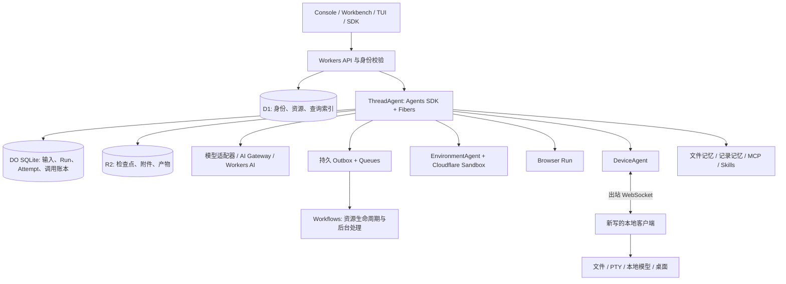

# Asterweft：Cloudflare 全量重写研究

研究日期：2026-10-07。状态：设计提案与范围基线，尚未实现产品。项目名称：**Asterweft**。部署范围已经确定为 **Cloudflare 云端 + 独立重写的本地客户端**。

## 1. 决策与结论

可以做。应当把它定义为一个完整 Agent 平台的独立实现，而不是给现有项目换部署文件。Agent Foundation 的主要价值在执行语义、持久状态、资源生命周期、工具与宿主的边界；这些都需要重新实现和验证。

本项目遵循四个约束：

1. **完全重写。** 新建仓库，不 fork、不改名搬运、不逐行翻译原实现，不把原测试、生成 schema、图标、截图或 Envd 二进制带入新项目。通用第三方库可以继续使用。
2. **功能全量对齐。** 固定基线内的困难能力仍是必需项，包括 Python 进程内执行、TUI、协作工作台、四种 SDK、所有 Provider 与跨平台桌面控制。阶段划分只安排顺序。
3. **云端基础设施在 Cloudflare。** 默认不要求用户另外部署 PostgreSQL、Redis 或其他云上的执行服务。可选模型、搜索、连接器和兼容环境供应商保留，不能因为迁移基础设施就删除它们。
4. **新品牌独立开源。** 采用 Asterweft、Apache-2.0 和独立版本体系。公开说明功能目标及来源，明确当前完成状态。

此前对原项目的研究曾建议复用上游做 MVP；该建议已被本次“独立、完整重写”的选择取代，不作为 Asterweft 的实施路线。

名字来自 aster 与 weft 的组合，指向多个执行过程交织成可追溯任务。2026-10-07 的 GitHub 仓库名称检索和 npm 包名检索未发现 Asterweft 同名项；这是当次检索结果，不是名称权利证明或包名预留。

## 2. 1:1 的参照物是什么

主仓库固定在 [`0a7d64d5173dfbbfbe8ab602695cf1ff6405483e`](https://github.com/converge-ai-labs/agent-foundation/tree/0a7d64d5173dfbbfbe8ab602695cf1ff6405483e)，提交时间为 2026-10-07 06:54:24 UTC。主分支的后续变化采用单独差异审查，不把一个持续移动的分支当作最终验收对象。

| 已清点的范围 | 数量 | 数量的含义 |
|---|---:|---|
| `spec/` Markdown | 87 | 含组件规范、索引及跨组件约定 |
| Service HTTP 路径 | 160 | 同一条路径可能有多个操作 |
| Service HTTP 操作 | 235 | 方法与路径组合 |
| 参照 OpenAPI schema 名称 | 319 | 仅统计；没有复制 schema 实现 |
| 环境协议方法 | 50 | 含文件、进程、会话、桌面与资源回收 |
| 模型 Provider | 21 | 按固定版本的注册表，而非 README 旧数字 |
| 环境 Provider | 11 | 既包括云厂商，也包括本地/远程运行方式 |
| Web Provider | 10 | 搜索与抓取的能力组合不同 |
| 记录记忆 Provider | 2 | mem0 平台与 OSS 路径 |
| 连接器 Provider | 1 | Composio；远程 MCP 是另外的连接能力 |
| 独立 Service SDK 仓库 | 4 | Python、TypeScript、Go、Rust；Rust 仓库另含远程 CLI |

本仓库已把这些事实关联到 **85 个功能验收组**。这是首轮需求分组，不代表只有 85 个行为，也不代表每个字段和异常分支已经形成测试。进入实现前，还要展开各组的场景、逐字段接口约定与参考运行结果。[功能目录](../parity/README.md)、[主基线](../parity/baseline.json)、[SDK 基线](../parity/sdk-baselines.json) 可直接审查。

### 三个不能混用的“等价”

- **功能等价：** 同一类用户可以完成同一任务，成功、等待、取消、恢复、权限和错误行为都可解释。这是必需目标。
- **协议兼容：** 原 API 客户端能否直接连接、相同请求得到什么结构。通过独立编写的兼容层实现并逐操作验证；不能从功能相似推断协议兼容。
- **内部实现相同：** 数据表、Python 类层次、锁、队列与部署方式完全相同。无需保留，且这次必须重新设计。

界面采用新品牌与新视觉，但保留操作能力与工作流程。Python 用户的进程内工具、回调和原生类型互操作属于功能，不能用“我们也提供 Python HTTP SDK”代替。

当前的源码审阅和接口清点没有运行原项目的真实任务。对需要运行证据的细节，必须先做独立参考场景，再实现差分验收；只看规范不能证明所有实际行为。

## 3. Cloudflare 最新产品的选型

以下是本次官方文档与 npm registry 的观察结果。产品可用性、套餐和包版本分别记录；版本号不等于生产成熟度。

| 产品 | Asterweft 中的职责 | 采用方式与边界 |
|---|---|---|
| Workers + Static Assets | API 入口、认证、控制台及工作台资源 | 默认应用宿主；不在请求生命周期里假装运行永久后台任务 |
| Agents SDK | 有状态 ThreadAgent、DeviceAgent、协作对象、调度和实时连接 | 主运行基础；每个可变聚合明确一个权威对象 |
| Agent sub-agents / Facets | 同一父对象下的协作子对象与类型化 RPC | 评估用于紧密关联的助手；持久 ChildRun 的归档和保留语义单独控制 |
| Agent Fibers | 可恢复的后台执行、状态查询和取消 | 应用保留自己的提交点与调用账本；Fiber 不保存 JavaScript 调用栈 |
| Think | Cloudflare 原生会话与工具循环适配器 | 可选引擎；需通过同一套语义测试，不能决定全部项目的数据格式 |
| Durable Object SQLite | 线程、输入队列、run/attempt、工具意图和 outbox | 执行状态权威；一个线程内序列化，不把一个大对象用于全部租户 |
| D1 | 身份、工作空间、资源目录、修订元数据与查询投影 | 按数据类型分清权威目录与可重建投影；不能照搬 PostgreSQL 调度 SQL |
| R2 | 产物、大附件、不可变检查点、长时历史分段 | 先写内容后提交引用；清理无引用对象，不能假定与 DO 原子提交 |
| Queues | 投递、索引更新、webhook、清理触发 | 接受重复和乱序，用稳定事件 ID、outbox 与补偿扫描处理 |
| Workflows | 沙箱创建/销毁、批处理、索引与独立长流程 | 与 Agent loop 分工，不让两个调度器同时拥有一个 run |
| Sandbox SDK 1.0 + Containers | Linux shell、Python 扩展、CodeAct 运行宿主与工具进程 | 按 1.0 API 独立编写环境适配层；进程与文件分别恢复 |
| Browser Run | 无头浏览器会话、网页读取与浏览器自动化 | 云端浏览器能力；本机桌面和已有本地浏览器状态由本地客户端提供 |
| AI Gateway | 模型请求路由、日志、成本、限流和预算规则 | 可选路由路径，保留各厂商原生协议与认证方式 |
| Workers AI | Cloudflare 模型与嵌入推理 | 默认可选模型来源；不能替代所有 21 个原 Provider |
| Vectorize | 默认语义记忆的检索索引 | 记录权威在 DO/D1/R2；索引异步更新与删除要可追踪 |
| AI Search | 托管知识库检索 | 可选知识源，不代替可编辑文件记忆或 mem0 记录 CRUD |
| Agent Memory | 原生长期记忆适配器 | 私有测试版，不能成为公共开源部署的必需依赖 |
| Code Mode + Dynamic Workers | TypeScript 工具编排与隔离执行 | 新增能力；不替代原有受限 Python CodeAct |
| Secrets Store / Workers Secrets | 部署级主密钥与服务秘密 | Secrets Store 仍为 open beta，可选；租户凭据独立加密存储，不为每个租户绑定一个 Worker secret |
| Workers Observability / OTel | 运行、模型与工具 trace、日志和故障诊断 | 产品自身保留必要的事件索引与权限过滤；不能依赖无限日志留存 |

官方依据见 [Cloudflare 证据目录](sources.md)。这里每一行是技术职责，不是声称已经接入。

### 3.1 必须按当前版本设计

| npm 包 | 本次 registry 版本 | 判断 |
|---|---|---|
| `agents` | `0.26.0` | 主 Agent SDK 候选锁定版本 |
| `@cloudflare/think` | `0.20.0` | 当前包的 peer dependencies 要求 AI SDK 7；概述页仍同时介绍 6/7 |
| `@cloudflare/sandbox` | `1.0.0` | API 已发生结构性变化，旧教程不能直接用 |
| `@cloudflare/codemode` | `0.5.3` | 作为可选编排适配器 |
| `ai` | `7.0.130` | 与 Think 当前包的依赖要求对齐 |
| `wrangler` | `4.148.0` | 当前要求 Node.js 22+ |
| `@pydantic/monty` | `1.1.0` | 受限 Python 候选依赖；其 WASM 包不能未经验证就假定能跑在 workerd |

这些是研究锁定候选，尚未构成通过构建和集成验收的 lockfile。实现阶段先做最小的依赖、打包及恢复验证，再锁定实际版本。也不采用浮动 `latest` 作为发布依赖。

### 3.2 Sandbox 1.0 的影响

新版本通过 Durable Object 的 `ctx.container` 使用容器能力；包提供文件等辅助工具。应用负责空闲超时、会话、预览路由、进程记录和错误恢复。旧的 `getSandbox()`/继承 `Sandbox` 代码不能直接当成 1.0 实现。[1.0 迁移说明](https://developers.cloudflare.com/sandbox/sdk/migrate/changes-in-1-0/)

沙箱快照保存可写根文件系统，不保存内存、进程、网络连接或单独挂载的文件系统；快照还具有有效期。因此任务状态、工作区文件、进程输出和 PTY 会话要分别建模，恢复后不能把旧 PID 当成仍在运行的进程。长期文件进入 R2，恢复动作由项目明确执行。[生命周期说明](https://developers.cloudflare.com/sandbox/concepts/lifetime/)

Sandbox SDK 发布 1.0 与底层全部能力 GA 是两回事。当前文档仍将 Durable Object 调度方式及容器快照标为测试阶段。开源安装文档需要列明使用这些能力的前提及失败诊断。[Sandbox 概述](https://developers.cloudflare.com/sandbox/)

### 3.3 Think 已经有用，但不能直接宣布覆盖原项目

Think 已提供会话、工具循环、持久化、流恢复、客户端工具和子 Agent 调用；它仍被官方描述为 experimental。先以 `Agent` 为宿主编写 Asterweft 的权威状态机，再让 Think 适配器参与同一组排队、等待、取消、分支和恢复验收，可以控制框架升级的影响。[Think](https://developers.cloudflare.com/agents/harnesses/think/)

Fibers 可以记录任务并在对象下次激活时进入恢复逻辑，但不是进程快照，也不让外部工具自动具有恰好一次语义。项目自己的调用意图与提交记录仍不可省略。[Durable execution](https://developers.cloudflare.com/agents/runtime/execution/durable-execution/)

最新 sub-agent API 使用 Facets：子对象有隔离的 SQLite，但与父对象同机，调度共享父对象的物理 alarm；删除子对象会连带删除其后代。因此不能直接把 `subAgent()` 当成原项目持久 ChildRun 的全部实现。默认持久子任务采用独立执行权威，保留父子结果与历史；紧密关联的助手可以另行验证 Facets 适配器。[Sub-agents](https://developers.cloudflare.com/agents/runtime/execution/sub-agents/)

### 3.4 记忆的默认实现不能依赖候补资格

Agent Memory 目前是 private beta。默认路径采用 Cloudflare 可公开部署的存储与检索组合；有资格的用户可以启用其适配器。文件记忆要保留版本和条件写，记录记忆要保留独立 CRUD/检索语义，知识搜索另做一种资源类型。[Agent Memory](https://developers.cloudflare.com/agent-memory/)、[AI Search](https://developers.cloudflare.com/ai-search/)

### 3.5 AI Gateway 已有金额预算，但不是全平台硬封顶

当前 AI Gateway 支持按模型、Provider 和自定义元数据的 spend limits。官方同时说明计费记录在请求完成后更新，规则最终一致，并发请求可能短时超额。它也不会统计项目所有沙箱、搜索和浏览器费用。原项目默认 OSS 没有金额账本，因此钱包与支付不是 1:1 的必需新增项。[Spend limits](https://developers.cloudflare.com/ai-gateway/features/spend-limits/)

## 4. 新架构如何保持原来的行为

### 执行状态只有一个权威

一个 ThreadAgent 持有自己的线程输入、run、attempt、调用记录和提交游标。D1 中的 run 列表用于查询；它不能反过来与 DO 同时修改当前执行状态。身份与资源目录则由 D1 明确拥有，运行时保存所选不可变修订的引用。

同一对象内遇到 `await` 仍可能有请求交错，不能只凭“actor”一词省掉状态版本检查。每次恢复提升执行代次，旧 attempt 在外部调用返回后必须重新验证代次，才可以提交。

R2 写入与 DO 提交不是一个事务。先写不可变对象，再原子更新 DO 中的引用与 outbox；失败留下的无引用对象以后回收。不能先发布一个尚未上传完成的 checkpoint。

### 输入被接收、被消费、完成是三个不同事实

提交返回稳定 receipt；run 真正消费该输入后，Interaction 才绑定那个 run。正在观察的流断开时，后台执行保持独立。等待用户、客户端工具或审批时，这次 Interaction 结束为等待态；后续恢复不是把一个无限连接一直挂着。

队列中的待处理输入可以更改顺序和撤回；已经消费的输入只能通过新事件继续操作。重复提交用 payload digest 检查幂等键，不能把相同 key、不同内容静默当成同一次请求。

### 外部副作用必须有“不确定”状态

工具执行前写入调用意图，执行后记录结果。进程可能在外部成功与本地记录之间退出。支持幂等 key 或查询 receipt 的工具可以恢复；纯读取可以按策略重试；其余操作进入可解释的不确定状态。不能为了界面好看而显示失败并偷偷再执行一次。

这保持了原项目“不保证外部恰好一次”的实际边界。所有发送、创建、删除类动作都应在自己已有的工具交互语义内处理，不额外发明一套业务审批产品。

### Python 嵌入是独立交付物

纯 TypeScript 云端内核无法直接满足“在用户 Python 进程里运行其 Python 函数”的能力。计划保留独立编写的 Python harness；它与 TS 内核共享新协议、行为样例和差分测试，但不通过 HTTP 假装本地执行。

Service 中的 Python 插件需要在 Cloudflare Sandbox 的 Python 进程执行，并以明确的扩展接口与云端状态机协作。通用模型库可使用 Pydantic AI，但不能依赖 `a13n-harness`。双运行时的一致性成本必须进入排期。

### 本地客户端不是可有可无的附件

计划以 Rust 编写进程与文件核心，并分别实现 macOS、Windows、Linux 桌面适配器。连接从设备主动发起，不要求用户开放电脑公网端口。配对身份、工作空间绑定、命令 ID、设备代次、期限与资源句柄一起验证；断线恢复查询既有命令，而不是重复提交。

本机文件权限、系统桌面权限和进程树清理属于真实平台测试。Linux 容器或 Browser Run 的成功不能代替 Windows/macOS 桌面验收。

## 5. 容量和成本应如何计算

### 已核验的工程边界

| 边界 | 本次官方资料 | 设计影响 |
|---|---|---|
| D1 单库 | Paid 最大 10 GB，单行/字符串/BLOB 最大约 2 MB；单库顺序处理查询 | 不存大消息块和附件；索引与归档、分片必须在数据增长前准备 |
| DO 存储 | DO 页列 Paid 每对象 10 GB；Agents 页仍写 1 GB | 文档不一致，按保守容量设计并在实际账号确认，不能宣传无限单会话 |
| Worker/DO 执行 | CPU 时间与墙钟等待时间不同 | 长网络等待不等于无限 CPU；大 JSON 和代码执行移到合适的环境 |
| Workflows | 单步结果约 1 MiB、完成后留存有上限 | 长期任务历史另存，不能把工作流后台当永久数据库 |
| Browser Run | Paid 默认 200 并发会话、每秒 3 个新浏览器；空闲超时可配置 | 用工作空间级队列与显式关闭控制资源；不能承诺瞬时无限新会话 |
| Containers | 公开类型有 CPU、内存、磁盘边界；快照存在有效期 | 自定义镜像、资源规格和长期产物归档分别管理 |

依据：[D1](https://developers.cloudflare.com/d1/platform/limits/)、[DO](https://developers.cloudflare.com/durable-objects/platform/limits/)、[Agents](https://developers.cloudflare.com/agents/platform/limits/)、[Workflows](https://developers.cloudflare.com/workflows/reference/limits/)、[Browser Run](https://developers.cloudflare.com/browser-run/limits/)、[Containers](https://developers.cloudflare.com/containers/platform/limits/)。Workflows 当前页面的并发限额表格与部分正文也存在差异；上线容量应读取实际账号配额，不能把冲突中的较大数字直接写成承诺。

### 成本模型

总成本 = Workers/DO 请求与执行 + DO/D1 存储读写 + R2 存储与操作 + Queue/Workflow + 容器运行 + 浏览器 + 模型/嵌入 + 搜索/连接器 + 日志/网络 + 本地客户端维护。

容器计费中，内存和磁盘按照运行期间的分配量，CPU 按实际使用量计费。2026-10-05 更新的官方价格分别为每 GiB 秒 $0.0000025、每 vCPU 秒 $0.000020、每 GB 秒 $0.00000007；还有 Workers Paid 基础费用、包含用量及其他费用。**不能只算 CPU 就把运行成本称作总成本。**[Containers pricing](https://developers.cloudflare.com/containers/platform/pricing/)

举例仅用于检验公式：1,000 个各 5 分钟的沙箱任务，每个分配 4 GiB 内存和 8 GB 磁盘，平均消耗 0.2 vCPU。在不扣套餐包含量时，三项合计约 $4.368；这没有包括模型、浏览器、Workers、DO、存储、网络和基础月费，也不是真实任务报价。模型循环长度和空闲沙箱保持时间通常会显著改变结果。

首轮真实测量应选文件编辑、网页研究、桌面操作三类任务，分别记录成功率、模型调用次数、冷启动、等待时间和完成一次成功任务的总花费。当前没有这些实测数据。

## 6. 从零重写的主要难点与验收

| 难点 | 必须取得的证据 |
|---|---|
| 运行恢复与外部副作用 | 在提交前后、调用前后、写结果前后主动中断；证明旧执行者被拒绝且不盲目重复动作 |
| 多模型协议 | 每个 Provider 至少完成文本流、工具调用后的继续、错误、取消与用量归因；媒体按能力分别测 |
| CodeAct | 受限 Python 与工具白名单、暂停恢复、超时和结果边界符合约定；不是随便执行一段 Python |
| Cloudflare 沙箱 | shell/argv、文件、PTY、输出偏移、空闲终止、镜像升级和文件恢复均有真实证据 |
| 桌面客户端 | 三个操作系统实际设备验证；macOS 权限与 Windows 进程/桌面行为不能靠编译结果代替 |
| Python 扩展生态 | 在用户 Python 进程中运行自定义函数及原生类型；云端插件桥接可取消和恢复 |
| 两套界面 | 管理控制台覆盖资源管理；工作台覆盖编辑器、终端、协作草稿、桌面和评论 |
| 长期维护 | 数据迁移、备份恢复、云端升级、本地升级、凭据轮换与 Provider 漂移都有独立流程 |

有些上游的行为来自独立 SDK 仓库而非主仓库。固定版本的 TypeScript、Go、Rust README 明确处于发布前源码阶段，不能把仓库存在当作包已发布。四个 SDK 当前共同绑定 Service 提交 `b174685e81012acccdd639463d90ec7ece7d6064`，其 OpenAPI 有 233 个操作；本次主基线有 235 个，新增等待回答的 GET/POST 接口和三个 schema。流协议文件未变，运行与 API 规范有更新。因此要分别验收 SDK 既有能力和主基线新接口，不能把旧 SDK 的范围当成全部范围。[契约差异记录](../parity/sdk-contract-delta.json)

## 7. 实施顺序与工作量判断

详细任务见 [完整重写计划](../plans/full-rewrite.md)。建议顺序为：参考行为与独立契约 → 状态与恢复 → Service → 环境与记忆 → 全 Provider 与工具 → Python/SDK/本地客户端 → 两套界面 → 全量兼容与发行。桌面和 Python 兼容的可行性验证应在前期完成，不能留到最后才发现底层选择错误。

这是平台级工程。不能沿用“二次开发 2–4 周”或“受限核心版 3–6 个月”的估算。作为立项占位，若有 4–6 位熟悉分布式运行时、Cloudflare、前端和跨平台系统的工程师，可先按 **6–12 个月** 的完整研发窗口组织预算；这只是风险较高的工程估算，不是交付承诺。参考行为固化与关键可行性验证完成后，应该按模块重新估算，而不是把行数换算成人天。

可以较早公开仓库和开发进展，但完整兼容声明必须等待整个基线验收。不能拿一次成功聊天、一张控制台截图或一个 Worker 部署结果代替全量完成。

## 8. 当前交付与下一步

本次完成了名称选择、Cloudflare 官方资料核验、基线清点、初版功能验收组、架构决策、故障模型、成本计算方法和完整实施顺序。公共仓库的文件与校验工具均独立编写。

**产品实现、参考运行差分测试、Cloudflare 账号内验证、Windows/Linux/macOS 桌面实测、完整 API/SDK 和生产部署仍未完成。** 当前材料是可审查的全量重写蓝图，不能被描述成“已经做出 1:1 版本”。后续状态以 [交付记录](delivery-status.md) 和各项证据为准。

## 参考入口

- [全部官方资料索引](sources.md)，含观测日期与证据清单。
- [独立实现与来源规则](provenance.md)。
- [系统架构与状态归属](../architecture/README.md)。
- [架构决策记录](../adr/README.md)。
- [功能、HTTP、环境协议与 Provider 清单](../parity/README.md)。
- [完整重写计划](../plans/full-rewrite.md)。
